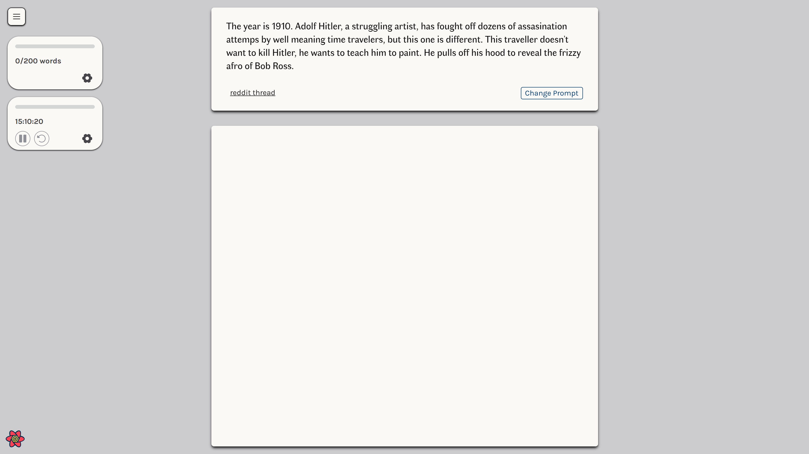

  <heading>
    
    <h1>write it</h1>
  </heading>

  
Kickstart your writing practice, with the help of <a href="https://www.reddit.com/r/WritingPrompts/" target="_blank">/r/writingprompt</a>.

   
  

## Key Features

- Writing prompts
  - Selected from the top posts of the writing prompt subreddit.
- Notepad
  - Your writings can be exported as a markdown file
- Countdown timer
- Word counter
- Zen mode to write without distraction
